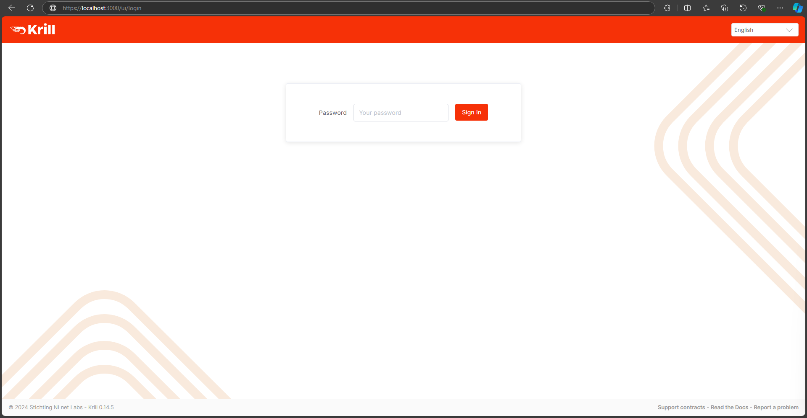

# Script de Instalação e Configuração do Krill

Este script automatiza a instalação e configuração do [Krill](https://krill.docs.nlnetlabs.nl/en/stable/), um software RPKI (Resource Public Key Infrastructure) de código aberto, em um sistema baseado em Debian. O script realiza as seguintes tarefas:

1. Atualiza a lista de pacotes.
2. Instala as dependências necessárias.
3. Adiciona o repositório NLnet Labs para o Krill.
4. Instala o Krill.
5. Configura o serviço para escutar em todos os endereços IP (`0.0.0.0`).
6. Habilita e inicia o serviço do Krill.
7. Exibe o status do serviço do Krill.
8. Mostra os logs do serviço do Krill.
9. Extrai e exibe o `admin_token` da configuração do Krill.

## Pré-requisitos

Este script foi projetado para ser executado em sistemas baseados em Debian (por exemplo, Debian, Ubuntu). Você precisa de privilégios `sudo` para executar o script, pois ele instala pacotes e modifica arquivos de configuração do sistema.

## RPKI Web



## Instalação

### 1. Clone o repositório ou baixe o script:

```bash
git clone https://github.com/matheusmoliveira/RPKI.git
cd RPKI
```

### 2. Execute o script:

Para executar o script e instalar o Krill, basta rodar:

```bash
chmod +x install_krill.sh
./install_krill.sh
```

Alternativamente, você pode executá-lo diretamente usando curl:

```bash
curl -fsSL https://raw.githubusercontent.com/matheusmoliveira/RPKI/main/install_krill.sh | bash
```

## Visão Geral do Script

O script realiza as seguintes etapas:

### 1. Atualizar a Lista de Pacotes

O script começa atualizando a lista de pacotes do sistema para garantir que as versões mais recentes dos pacotes sejam instaladas.

```bash
sudo apt update
```

### 2. Instalar Dependências

O script instala as dependências necessárias para o Krill:

ca-certificates
curl
gnupg
lsb-release

```bash
sudo apt install -y ca-certificates curl gnupg lsb-release
```

### 3. Adicionar o Repositório NLnet Labs

Ele baixa a chave GPG e adiciona o repositório oficial da NLnet Labs, que contém o pacote do Krill.

```bash
curl -fsSL https://packages.nlnetlabs.nl/aptkey.asc | sudo gpg --dearmor -o /usr/share/keyrings/nlnetlabs-archive-keyring.gpg
```

O script então adiciona o repositório ao sistema:

```bash
echo "deb [arch=$(dpkg --print-architecture) signed-by=/usr/share/keyrings/nlnetlabs-archive-keyring.gpg] https://packages.nlnetlabs.nl/linux/debian $(lsb_release -cs) main" | sudo tee /etc/apt/sources.list.d/nlnetlabs.list > /dev/null
```

### 4. Instalar o Krill

Após atualizar a lista de pacotes novamente, o script instala o Krill:

```bash
sudo apt update
sudo apt install -y krill
```

5. Configurar o Krill

O script adiciona a seguinte linha ao arquivo de configuração /etc/krill.conf para vincular o serviço a todos os endereços IP:

```bash
ip = "0.0.0.0"
```

Isso é feito adicionando a linha ao final do arquivo de configuração.

```bash
sudo bash -c 'echo "ip = \"0.0.0.0\"" >> /etc/krill.conf'
```

6. Iniciar e Habilitar o Serviço do Krill

O script habilita o serviço do Krill para iniciar automaticamente na inicialização e inicia o serviço imediatamente:

```bash
sudo systemctl enable --now krill
```

7. Verificar o Status do Serviço do Krill

Você pode verificar o status do serviço do Krill com o seguinte comando:

```bash
sudo systemctl status krill
```

8. Visualizar os Logs do Krill

Para visualizar os logs do serviço do Krill, o script usa journalctl:

```bash
sudo journalctl --unit=krill
```

9. Exibir o admin_token

O script extrai e exibe o admin_token do arquivo de configuração do Krill /etc/krill.conf:

```bash
echo "admin-token = $(sudo grep 'admin_token' /etc/krill.conf | head -n 1 | cut -d '"' -f2)"
```

## Licença

Este script é liberado sob a Licença MIT.

## Contribuições

Contribuições são bem-vindas! Sinta-se à vontade para enviar um pull request ou abrir uma issue para melhorar o script ou adicionar novos recursos.

## Suporte

Se você encontrar algum problema ou tiver perguntas, por favor, abra uma issue neste repositório ou entre em contato com a equipe de suporte.
